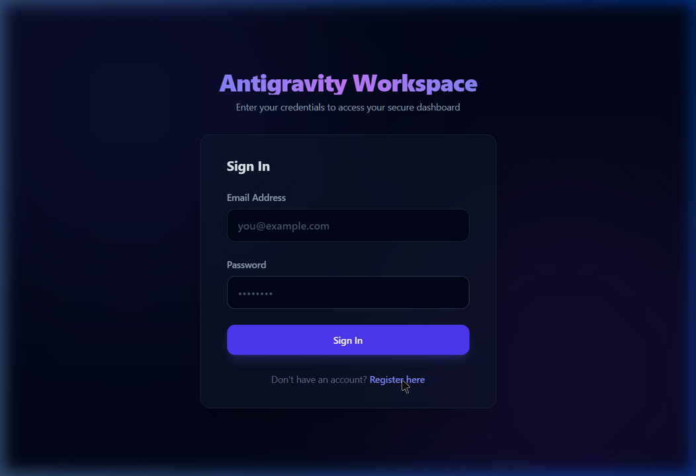
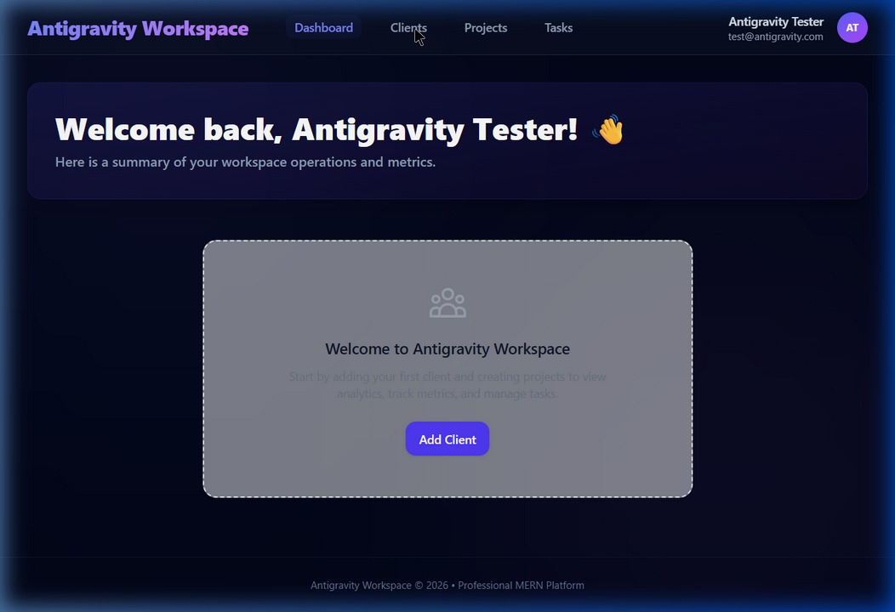
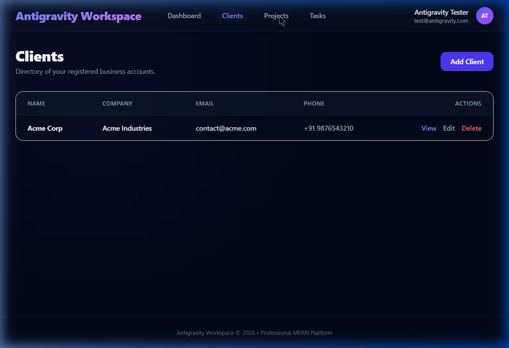
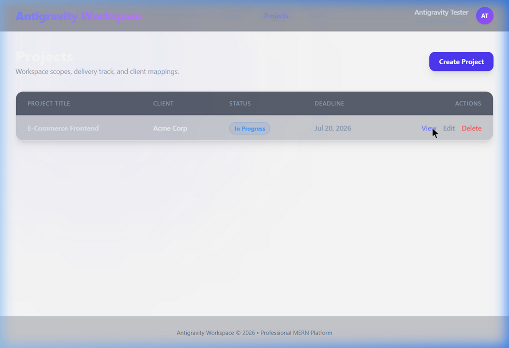
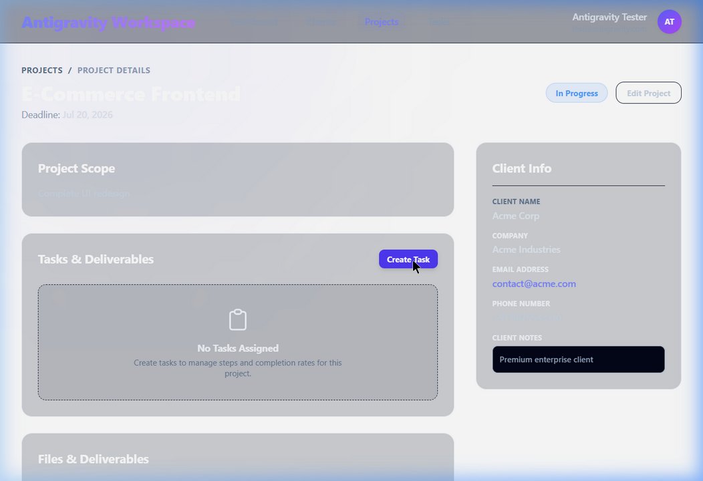
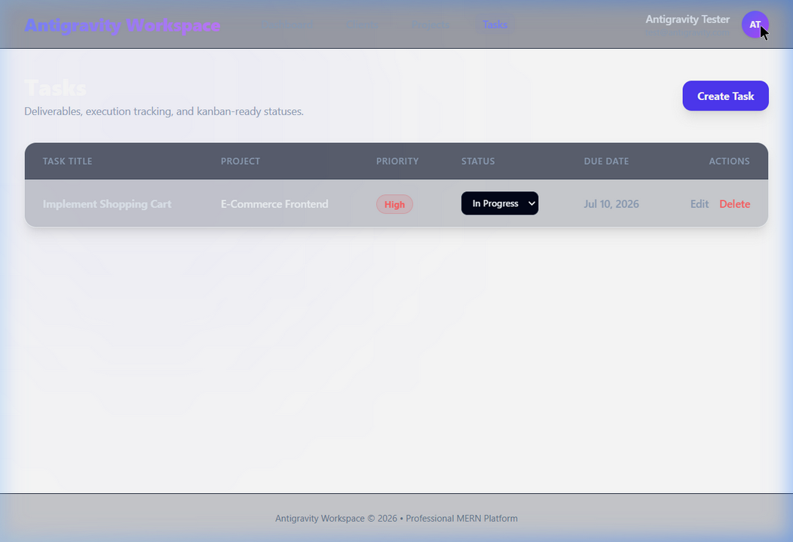
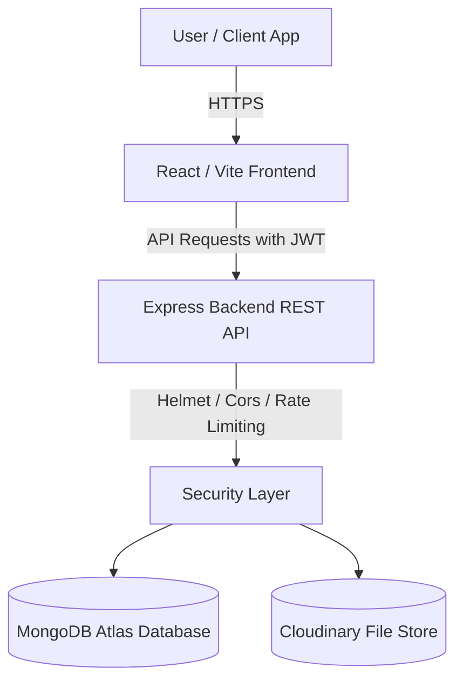

# Antigravity Workspace 🚀

A modern, high-fidelity MERN stack SaaS platform built for freelancers, agencies, and teams to manage clients, track project details, prioritize tasks, and store assets securely in a unified workspace.

---

## 📸 Application Showcase

Here are views of the Antigravity Workspace system:

| View | Screenshot |
| :--- | :--- |
| **User Access Control** |  |
| **SaaS Analytics Dashboard** |  |
| **Client Management** |  |
| **Projects List** |  |
| **High-Fidelity Project Details** |  |
| **Task Management Board** |  |

---

## ✨ Features

- 🔐 **Secure Session Management**: Built with JWT tokens, encrypted password hashing, custom AuthContext, auto-login hooks, and secure sign-out drawers.
- 📊 **Visual Performance Analytics**: Renders client distribution, task statuses, recent projects, and overall productivity logs using interactive charts powered by **Recharts**.
- 👥 **Client Relations**: Easily create, view, edit, and delete client profiles, featuring robust international country-code phone number validation (`+91 9876543210`).
- 📁 **Project Details & Tasks**: Drill down into projects to monitor budgets, track deadlines, assign tasks (Todo, In Progress, Completed), and review priorities.
- ☁️ **Cloudinary Media Storage**: Attach project proposals, contracts, assets, and invoices directly to projects with file upload tracking.
- 🛡️ **Production Security Core**: Armed with `helmet` headers, standard CORS policies, centralized Express middleware error handlers, and login rate limiters.

---

## 🛠️ Tech Stack

### Frontend
- **React (v19)** with Vite (fast bundling & hot module replacement)
- **Vanilla CSS / Modern Tailwind CSS** (sleek layout, glassmorphism, responsive breakpoints)
- **Recharts** (clean responsive charts)
- **React Router DOM** (declarative route navigation)
- **React Hot Toast** (professional success/error toast alerts)

### Backend
- **Node.js** & **Express** (scalable RESTful APIs)
- **MongoDB Atlas** & **Mongoose** (dynamic document modeling)
- **Cloudinary SDK** (remote file storage)
- **express-validator** (clean request input validation rules)
- **express-rate-limit** & **helmet** (production-grade API protection)

---

## 🏗️ System Architecture



---

## ⚙️ Environment Configurations

### Backend (`server/.env`)
Create a `.env` file in the `server` folder with the following variables:
```env
PORT=5000
MONGO_URI=mongodb+srv://<username>:<password>@cluster0.mongodb.net/workspacepro
JWT_SECRET=your_jwt_signing_secret_key
CLOUDINARY_CLOUD_NAME=your_cloudinary_cloud_name
CLOUDINARY_API_KEY=your_cloudinary_api_key
CLOUDINARY_API_SECRET=your_cloudinary_api_secret
CLIENT_URL=http://localhost:5173
```

### Frontend (`client/.env`)
Create a `.env` file in the `client` folder with the following variable:
```env
VITE_API_URL=http://localhost:5000
```

---

## 🚀 Getting Started

### 1. Prerequisites
- **Node.js** (v18+)
- **MongoDB Instance** (Local MongoDB or Atlas Cloud account)
- **Cloudinary Account** (for file upload integration)

### 2. Local Installation
Clone the repository and install dependencies for both the server and client:

```bash
# Install Server Dependencies
cd server
npm install

# Install Client Dependencies
cd ../client
npm install
```

### 3. Running the App Local dev environment
In two separate terminals, boot up the local dev environment:

```bash
# Run server (boots on Port 5000)
cd server
npm run dev

# Run client (boots on http://localhost:5173)
cd client
npm run dev
```

---

## 🌐 Production Deployment

### Backend Deployed on **Render**
1. Create a Web Service connected to your Git repository.
2. Root directory: `server/`.
3. Build Command: `npm install`.
4. Start Command: `node server.js` (or `npm start`).
5. Configure environment variables matching `server/.env`.

### Frontend Deployed on **Vercel**
1. Create a new project on Vercel.
2. Select your Git repository.
3. Set the Root directory to `client/`.
4. Configure the environment variable: `VITE_API_URL` pointing to your deployed Render URL.
5. Deploy.
