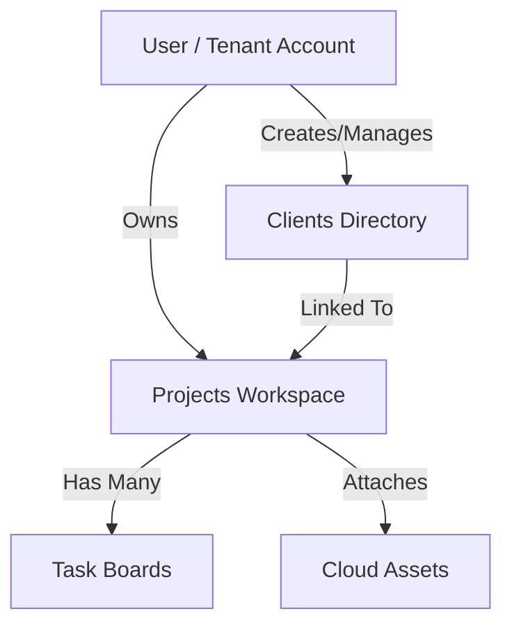

# WorkspacePro – SaaS Client, Project and Task Management Platform

A high-performance, responsive, and secure MERN-stack SaaS application engineered to streamline workflows for freelancers, startups, agencies, and small businesses.

---

## 1. Executive Summary
**WorkspacePro** is a centralized Software-as-a-Service (SaaS) management platform designed to unify client relationships, project scopes, task trackers, and team resource files into a single workspace. Unifying disjointed productivity channels, WorkspacePro addresses workspace clutter and mitigates context switching. Built using React 19, Vite, Express, Node.js, and MongoDB, the system isolates user records securely via JWT and enforces strict resource ownership validators at both database and middleware layers.

---

## 2. Problem Statement
Freelancers, startups, and agencies face significant friction in day-to-day operations:
* **Disjointed Channels**: Information is scattered across multiple platforms (e.g. email for client communication, spreadsheets for tracking, Trello for tasks, Google Drive for files).
* **High Context Switching Costs**: Jumping between tools leads to lost information, missed deadlines, and reduced focus.
* **Low Visibility**: Startups lack a single dashboard summarizing active client status, project delivery timelines, and critical priorities.
* **Data Security & Privacy Issues**: Collaborative environments need secure, isolated user workspaces to prevent cross-tenant leakages.

---

## 3. Proposed Solution
WorkspacePro unifies operations by offering:
* **Centralized Hub**: A unified workspace organizing clients, projects, tasks, and files.
* **Granular Security & Authentication**: Strict authentication protocols restricting all data queries using validated JWT tokens.
* **Isolated Client Directories**: A directory structure where clients are tied to the verified user account.
* **Interactive Kanban & Project Tracks**: Visual tools to monitor progress, change project states, and set priority attributes.
* **Unified Dashboard**: Live metrics summarizing account status, active scopes, and pending tasks.

---

## 4. Project Objectives
* **Optimize Operations**: Lower administrative task times so teams can focus on core development.
* **Unify Workspace Data**: Aggregate files, documents, and project details in one central database.
* **Robust Security Principles**: Prevent cross-tenant data visibility via strict Mongoose query filters.
* **Modern Developer Practices**: Leverage Vite's fast compilation and MERN's modular patterns.

---

## 5. Technologies Used

### Frontend
* **React.js & Vite**: Selected for high-speed compilation, hot-module reloading (HMR), and declarative, stateful UI transitions.
* **React Router DOM**: Drives efficient single-page application routing, param injection (`useParams`), and client-side guards.
* **Axios**: Handles promises, requests, response interceptions, and automatically binds the bearer token header.
* **Tailwind CSS**: Powering a modern visual aesthetic with glassmorphic cards, custom animations, and layout scales.

### Backend
* **Node.js & Express.js**: Handles highly concurrent asynchronous network operations, routing, and controller middleware.

### Database
* **MongoDB & Mongoose**: Flexible document store model perfect for unstructured client notes, metadata fields, and relational mapping via `ObjectId`.

### Security & Services
* **JWT & bcryptjs**: Handles user auth payload signings, token verifications, and strong cryptographic password salt-hashing.
* **Cloudinary**: Integrates cloud-backed file assets storage and optimization.

---

## 6. System Architecture

* **Data Flow**: The frontend routes API calls using `clientService` modules. Express verifies the token via `authMiddleware.js`, loads context into `req.user.id`, and routes to controller queries.
* **Relationships**: Every record query has `ownerId` filters, isolating data between concurrent users.

---

## 7. Database Design

### User Schema
* `name`: String, required.
* `email`: String, required, unique index.
* `password`: String, required (hashed).
* `role`: String, default 'user'.

### Client Schema
* `ownerId`: ObjectId, ref User, indexed.
* `name`: String, required.
* `email`: String, required.
* `phone`: String.
* `company`: String.
* `notes`: String.

### Project Schema
* `title`: String, required.
* `description`: String.
* `status`: String (Planning, In Progress, Completed).
* `deadline`: Date.
* `clientId`: ObjectId, ref Client, indexed.
* `ownerId`: ObjectId, ref User, indexed.

### Task Schema
* `projectId`: ObjectId, ref Project, indexed.
* `title`: String, required.
* `description`: String.
* `priority`: String (Low, Medium, High).
* `dueDate`: Date.
* `status`: String (To Do, In Progress, Review, Done).

---

## 8. Functional Requirements

### Authentication
* **Register**: Create custom accounts with encrypted passwords.
* **Login**: Validated sessions returning a JWT.
* **Logout**: Discards client-side storage keys.

### Client Directory
* **CRUD**: Create, read, view details modal, edit, and delete business contacts.

### Project & Task Workspace
* **CRUD**: Organize project milestones and allocate tasks.

---

## 9. Feasibility Study

* **Technical**: React, Express, and MongoDB are mature, highly documented systems, minimizing implementation risk.
* **Economic**: Runs entirely within free-tier limits (MongoDB Atlas, Render, Vercel, and Cloudinary), matching zero-budget environments.
* **Operational**: Highly accessible dashboard design. Single-click deployment links streamline operations.

---

## 10. Advantages of the Project
* **Eliminates Clutter**: Reduces browser tabs by organizing tasks, files, and clients.
* **High Design Standard**: Glassmorphism aesthetic built on dark mode layouts.
* **Tenant Isolation**: Secure data boundaries across user namespaces.

---

## 11. Future Enhancements
* Real-time team notifications.
* Role-based access control (Admin, Member, Client).
* Integrated invoice generation and time tracking.
* Redis caching and containerization (Docker).

---

## 12. Resume & Career Impact
* **Full-Stack Competency**: Demonstrates absolute proficiency across databases, controller modules, routing mechanisms, state management, and modern styling.
* **Professional Engineering**: Showcases rigorous Git-flow paradigms, test pipelines, and architectural patterns.
* **Job Placement Advantage**: Stands out in full-stack developer and software engineering interviews as a complete, deployed, secure SaaS application.
